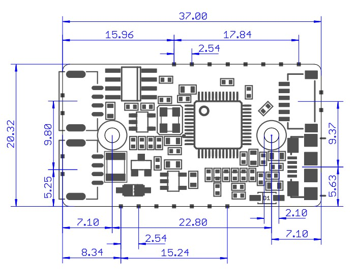
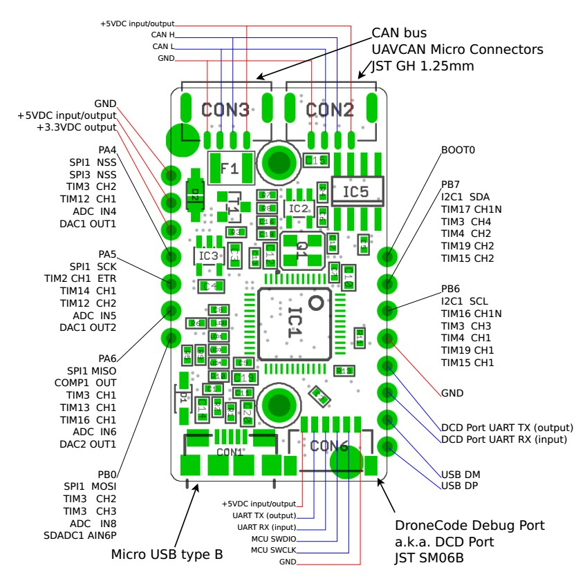

# DrjLab CAN Adapter

DrjLab CAN-Adapter是一款由DrjLab基于[Zubax_Babel](https://github.com/zubax/zubax_babel.git)优化和改进的高性能USB-CAN和UART-CAN调试器。它采用准标准SLCAN/LAWICEL协议，能够支持绝大部分CAN软件产品，包括Linux SocketCAN框架。如果CAN-Adapter用于调试[UAVCAN](http://uavcan.org)网络建议使用[UAVCAN GUI TOOL](http://uavcan.org/GUI_Tool)上位机，它完全支持CAN-Adapter中提供的所有高级功能。

- 完美支持[UAVCAN](https://uavcan.org/)协议和[Pixhawk](https://github.com/px4)硬件，兼容[zubax_babel](https://github.com/Zubax/zubax_babel.git)固件
- 超低延迟，主机系统上的USB端口和CAN总线之间的总延迟低于1毫秒
- 高吞吐量，该设备在任何一个方向上每秒处理超过5000帧
- RX缓冲区，允许设备处理短期的流量突发，而不会造成帧丢失
- 内置嵌入式软件可控制的120欧姆终端电阻
- 内置嵌入式软件可控制的5V@400mA总线供电
- 准标准SLCAN/LAWICEL接口到主机系统，与市场上的各种软件产品兼容
- 在Windows、OSX、Linux环境下都无需驱动

## 使用说明
如果CAN-Adapter用于调试[UAVCAN](http://uavcan.org)网络建议使用[UAVCAN GUI TOOL](http://uavcan.org/GUI_Tool)上位机，它完全支持CAN-Adapter中提供的所有高级功能。Linux和OSX系统上安装 UAVCAN_GUI_TOOL 请参考 https://github.com/UAVCAN/gui_tool。

 Windows环境请按照如下步骤：

1. 下载并安装最新版的 [UAVCAN GUI TOOL](https://files.zubax.com/products/org.uavcan.gui_tool/) 上位机
1. 用USB数据线连接PC和CAN-Adapter的CON1接口
1. CAN设备连接到CAN-Adapter的CON2或CAN3接口
1. 愉快的使用GUI TOOL控制和显示UAVCAN数据流

## 接口定义
DrjLab CAN-Adapter和Zubax_Babel采用相同的接口定义：
- CON1：Micro USB type B，连接PC上位机UAVCAN GUI TOOL
- CON2和CON3：JST，连接其它CAN设备，比如PX4
- CON6：DroneCode Debug Port，连接调试串口和SWD

## 参考资料
- [UAVCAN Specification](https://new.uavcan.org/specification)
- [Zubax Babel Datasheet](https://files.zubax.com/products/com.zubax.babel/Zubax_Babel_Datasheet.pdf)